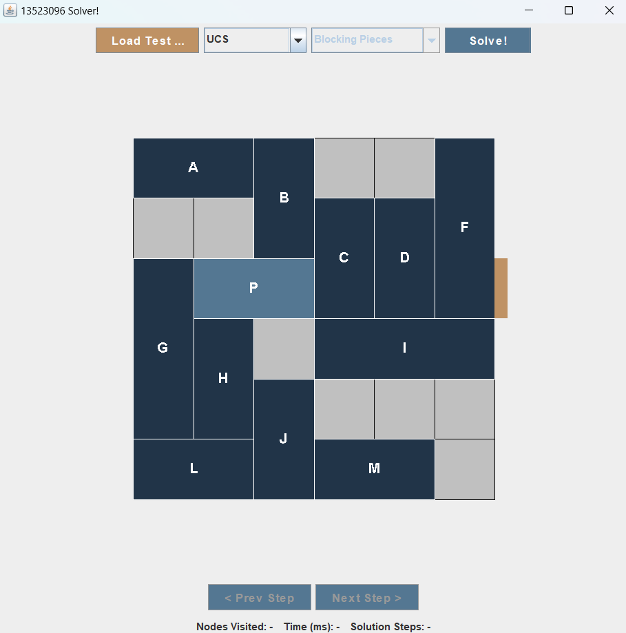

<h2 align="center">Rush Hour Solver Menggunakan Algoritma Pathfinding </h2>

<em>Tugas Kecil 3 IF2211 Strategi Algoritma 2025</em>

  

<h2> About This Project</h2>

This program, developed in Java using the Swing toolkit for the GUI, implements various pathfinding algorithms to solve the Rush Hour puzzle. The core challenge is to maneuver a primary vehicle out of a gridlocked board through a designated exit point in the minimum number of moves.

The solver explores different strategies, including uninformed search algorithms like Uniform Cost Search (UCS) and Iterative Deepening Search (IDS), as well as informed (heuristic) search algorithms such as Greedy Best-First Search (GBFS), A*, and Iterative Deepening A* (IDA*). Users can select the algorithm and, for heuristic-based searches, choose between different heuristic functions: "Blocking Pieces Heuristic" and "Manhattan Distance Heuristic".

This project was developed as an assignment for the IF2211 Algorithmic Strategies course.

<h2> Project Structure</h2>

<pre>
.
├───bin
│   └───classes
│       └───Solver/
├───doc
├───src
│   └───Solver/
└───test/
              
</pre>

<h2> Getting Started</h2>

<h3> Prereq</h3>
<ul>
  <li><strong>Java Development Kit (JDK)</strong>: Version 8 or newer.</li>
  <li>Java Swing is part of the standard JDK, so no external GUI libraries are needed.</li>
</ul>

<h3> Installation</h3>
<ol>
  <li><strong>Clone the Repository:</strong>
    <pre><code class="lang-bash">git clone https://github.com/poetoeee/Tucil3_13523096
cd Tucil3_13523096</code></pre>
  </li>
  <li><strong>Run the Application:</strong>
    <pre><code class="lang-bash">java -jar bin/SolverApp.jar</code></pre>
  </li>
</ol>

<h2>Author</h2>
<ul>
  <li>Muhammad Edo Raduputu Aprima (13523096)</li>
</ul>

---

Selamat Mencoba!

